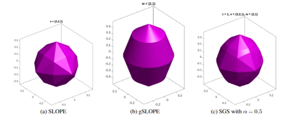

This chapter will provide the (genetics) motivation for the problem we are trying to solve. It will then provide mathematical descriptions of the penalised regression methods that we will use. R code is provided for implementing the methods to simple examples, which will be expanded to the genetics data in Chapter 3. During this chapter, think about how these methods can be adapted to working with genetics data, which we will then cover in Chapter 3.

# Motivation (optional)
The genetics background for understanding the motivation was described in Chapter 1. 
Here, we give a detailed description of the problem we are trying to solve, from a genetics point of view. The mathematical formulation of the problem is described in the next section.

A key problem in genetics is to identify which genotypes (genetic markers) are associated with phenotypes (trait).
Early approaches of identifying these genotypes used univariate analysis, where each gene was independently tested for association with the outcome.
In these analyses, simple statistical tests, such as the t-test, are used to calculate p-values on the significance of single gene expressions on a phenotype [R1]. 
However, genes sit within groups (called pathways), and so these approaches do not fully utilise the biological information available. 
We might expects genes in the same pathways to behave in similar ways and interact with each other.

Pathway analysis, also known as gene set analysis, attempts to make use of the information about the biological set-up of the genes being investigated, with the hope of this leading to more accurate models. 
As such, the aim of pathway analysis is to identify pathways, which are groups of genes, that have an association with a particular phenotype. 
Popular examples of pathway analysis methods include over-representation analysis (ORA), functional class scoring (FCS) methods, and pathway topology analysis (PTA) [R1].

The problem of selecting relevant pathways can be seen as both an individual variable and group selection problem - we want to find both the relevant pathways and the genes within those pathways.
Methods for variable selection are countless, ranging from simple linear regression to more sophisticated approaches, such as neural networks [R2, R3]. 

In pathway analysis, we use datasets with more genes ($p$) than individuals ($n$) to which they belong. As such, pathway analysis falls under the $p>>n$ umbrella of problems (this is the field of high-dimensional statistics), commonly known as *short, fat data problems*. 
Additionally, as only a small fraction of genes and pathways tend to be disease-associated, we seek methods which encourage sparse solutions [R4, R5].

A particular family of methods which are often used to solve $p>>n$ problems and generate sparse solutions are penalised regression methods, which we discuss next.

# Penalised regression
*Note on notation*: $\beta_i \in \mathbb{R}$ will refer to the coefficient for a variable $i$, whilst $\beta^{(g)} \in \mathbb{R}^{m_g}$ refers to the vector of coefficients for the variables in group $g$ (of which there are $m_g$).

In the traditional linear regression setting, we have response data $y$, of dimension $n$, and input data $X$, of dimension $n\times p$, and a corresponding model given by $y = X\beta + \epsilon$, where $\epsilon \sim N(0,\sigma^2), \sigma^2>0$. 
With the rise of big data, we are increasingly tackling datasets where $p>>n$ (which falls under the umbrella of high-dimensional statistics), including in cyber security, biomedical imaging, and as mentioned above, pathway analysis. 
In such cases, there are insufficient degrees of freedom to estimate the full model. Indeed, the solution to linear regression (ordinary least squares) can not be computed for high-dimensional datasets, as the inverse of $X$ does not exist (which is needed for the solution).

## Lasso
As a solution for dealing with such a situation, [R6] introduced the *least absolute shrinkage and selection operator* (lasso). The lasso performs variable selection by regularisation; that is, it minimises a loss function subject to some constraints. 
Formally, the lasso finds $\beta$ estimates by solving
$$
\hat{\beta}_\text{lasso} = \min_\beta \left\{ \frac{1}{2}\left\|y- X \beta\right\| _2^2 + \lambda \left\| \beta \right\|_1 \right\},
$$
where $\left\| \cdot \right\|_1$  is the $\ell^1$ norm and $\left\| \cdot \right\|_2$ is the $\ell^2$ norm. The parameter $\lambda$ defines the amount of sparsity in the fitted model. 

If $\lambda$ is large, very few coefficients will be non-zero and the model will be very sparse. On the other hand, small values of $\lambda$ will lead to a model with many non-zero coefficients, eventually leading to $\lambda = 0$, where we recover the ordinary least squares solution.
We can pick $\lambda$ subjectively ourselves, but the most common approach is to fit models for different values of $\lambda$ and select the best one using cross-validation (the one with the lowest error).

The approach generates sparse solutions by shrinking some coefficients and setting others to 0 exactly, retaining the desirable properties of subset selection and ridge regression [R6] - this is shown in the figure below. The figure shows the solutions of the lasso (left) and ridge regression (right) for $p=2$. The blue regions are the constraint regions and the red eclipses are the contour lines of the least squared errors function. The solutions are given by where the contours hit the constraint region.

![Solutions of the lasso (left) and ridge regression (right) for $p=2$. The blue regions are the constraint regions and the red eclipses are the contour lines of the least squared errors function. The solutions are given by where the contours hit the constraint region. This figure is from [R7].](assets/images/ridgevslasso.png)

As a consequence of the diamond shape of the lasso constraint region, if the solution occurs at the corner, the corresponding parameter $\beta_j$ is set exactly to 0, which is not possible with the ridge constraint region [R7]. For $p>2$, the diamond is a rhomboid, which has many edges, and we retain this desirable property of the lasso.

We can implement the lasso in R using the `glmnet` package, which is one of the most widely used packages. To run the lasso, we create some synthetic Gaussian data
```{r}
set.seed(2)
X <- matrix(rnorm(100 * 20), 100, 20)
beta <- c(rep(5,5),rep(0,15))
y <- X%*%beta + rnorm(100)
```

We can run the lasso using the default set-up, specifying only that we want to run the model for 20 values of $\lambda$.
```{r}
library(glmnet)
fit <- glmnet(x = X, y = y, family = "gaussian", nlambda = 20, lambda.min.ratio = 0.1)
```

**Q1: run the same model again but without standardising. What do you observe?** 

**Q2: what happens if we do not specify how many $\lambda$'s we want?**

**Q3 (optional): the glmnet documentation states that there is a parameter $\alpha$ that we can change. What does this do?**

**Q4 (optional): look at the glmnet documentation - which parameters might be interesting to vary?**

The model will be run from the value of $\lambda$ that generates a null model (no active variables) to the final value of $\lambda$ that is a specified proportion of the first value (the value of `lambda.min.ratio`).
We can visualise the path of $\lambda$ values, which take a log-linear shape (by design)
```{r}
plot(fit$lambda,type="b")
```
We can also visualise some of the active coefficients using
```{r}
plot(fit)
```
and we can observe that the coefficients become larger in absolute value as the value of $\lambda$ become smaller.
So we now have 20 lasso models and we want to pick a single one to use for prediction. The most popular option is to use cross-validation:
```{r}
fit.cv <- cv.glmnet(x = X, y = y, family = "gaussian", nlambda = 20, lambda.min.ratio = 0.1)
print(fit.cv)
```
In the print-out, there are actually two different "minimums" defined. The first is `min`, which is the absolute minimum error obtained by any of the models. The other is `1se`, which is the simplest model that is within one-standard error of the minimum. This is often used as a more conservative estimate of the best model, as it is less likely to be overfitting the data. Using the `1se` model, we can compare the obtained coefficients to the true beta values
```{r}
cbind(beta,fit.cv$glmnet.fit$beta[,19])
```
and we find the lasso does very well. It correctly picks out the first five variables as those with a signal and correctly sets the rest to zero. In Chapter 3, where we apply these methods to real data, we will instead pick $\lambda$ to be the value that minimises the error on a test data set.

We can now use these fitted coefficients to predict $y$. To fairly test the accuracy of the model, we first need to generate some new data (that uses the same $\beta$ signal)
```{r}
set.seed(3)
X_new <- matrix(rnorm(10 * 20), 10, 20)
y_new <- X_new%*%beta + rnorm(10)
```
and we can predict the new $y$s values using the lasso model
```{r}
cbind(y_new,predict(object = fit.cv, newx = X_new, s = "lambda.1se"))
```
and we find our predictions are not too bad. We can get a prediction error score (using the mean squared error)
```{r}
mean((y_new-predict(object = fit.cv, newx = X_new, s = "lambda.1se"))^2)
```

**Q5: instead of using the predict function, manually code a prediction.**

**Q6: compare the predictions of the 1se model against the min model.**

## Group lasso
We mentioned in the motivation that genes come in groups and that we would like to utilize this grouping information. 
To that end, [R8] adapted the lasso approach to the problem of selecting grouped variables by introducing the *group lasso* (gLasso). 
Let $X^{(1)}, \dots, X^{(G)}$ be non-overlapping groups of variables (all groups are assumed to be non-overlapping), then the solution is given by
$$
\hat{\beta}_\text{gLasso} = \min_{\beta} \left\{ \frac{1}{2}\left\|y-\sum_{g=1}^{G} X^{(g)} \beta^{(g)} \right\|_2^2 + \lambda  \sum_{g=1}^{G} \sqrt{p_g} \left\| \beta^{(g)} \right\|_2 \right\},
$$
where $\sqrt{p_g}$ is the number of variables in group $g$. If the size of each group is 1, then we recover the lasso solution. 
The group lasso creates sparsity at a group level by shrinking whole groups exactly to 0, so that each variable within a group is shrunk to 0 exactly. 
The group lasso has found widespread use in finding significant genetic variants [R9, R10].

There are two main R packages for fitting the group lasso: `grplasso` and `gglasso`. 
We will use the `grplasso` package, as it contains additional features. To use the group lasso, we need grouping indexes for the variables. 
In genetics, natural groupings are found through pathways (which we saw in Chapter 1). If a natural grouping does not exist, algorithms that perform some form of grouping can be used (such as k-means clustering). 
For simplicity, in this case we will manually assign the variables into groups of size 4.
```{r}
groups <- rep(1:5,4)
```
The `grplasso` package does not automatically calculate a path of $\lambda$ values, so we compute those first, starting with the first $\lambda$ value using the `lambdamax` function from the package.
Additionally, the package does not implement an intercept and standardisation in the same way as `glmnet`, so we do this manually. In general, when working with penalised regression models, it is a good idea to fit an intercept and apply standardisation. In general, when in doubt about whether a package performs standardisation properly, a useful check is to compare it to `glmnet`, as this is the gold standard of R packages (most penalised regression models reduce to the lasso under certain hyperparameter choices, so a direct comparison is possible most of the time).

**Q7: compare the `grplasso` package to `glmnet` to see if standardisation works properly?**

```{r}
library(grplasso)
# standardise data
X_gl <- t(t(X) - apply(X, 2, mean)) # center data
X_gl <- t(t(X_gl) / apply(X_gl, 2, sd)) # scale data
X_gl <- cbind(1, X_gl) # add intercept
groups_gl <- c(NA, groups) # we add NA as the intercept does not belong to a group

# generate lambda sequence
lambda_max_group <- lambdamax(X_gl, y, groups_gl, standardize = FALSE, center = FALSE) # finding lambda max, we can ignore the warning
lambdas_gl <- exp(seq( # calculating the full lambda sequence
  from = log(lambda_max_group),
  to = log(lambda_max_group * 0.1), # the equivalent of lambda.min.ratio in glmnet
  length.out = 20 # how many lambdas we want
))

# fit model
glasso_model <- grplasso(x = X_gl, y = y, index = groups_gl, lambda = lambdas_gl, standardize = FALSE, center = FALSE, model = LinReg())
```
Comparing the model coefficients to the true ones (for the most saturated model, removing the intercept value):
```{r}
cbind(beta, glasso_model$coefficients[-1,20])
```
and using it to predict the output (you will notice we have to do a few things manually, such as adding the intercept to `X_new`, because, as mentioned, many R packages do not have as complete features as `glmnet`)
```{r}
mean((y_new-predict(object = glasso_model, newdata = cbind(1,X_new))[,20])^2)
```
This case demonstrates a real limitation of the group lasso. In our manual grouping, we placed a signal variable (one that is not zero) in each group, forcing the group lasso to pick each of those groups as non-zero. The group lasso picks whole groups, so that it is in turn forced to make every variable in those groups non-zero.
In the next section, we explore a solution to this issue, which is especially limiting in genetics.

**Q8: set the group indexing so that the signal variables are all in the same group. What do you observe?**

## Sparse-group lasso
Using the group lasso for pathway analysis would require the assumption that all genes in a significant pathway are also significant, not allowing for additional sparsity within a group [R11]. So, one may wish to have sparsity at both the group (pathway) and variable (gene) level. 

To fulfil this wish, [R9] introduced the *sparse-group lasso* (SGL), which combines traditional lasso with the group lasso to create models with bi-level sparsity. 
The solution to SGL is given by
$$
\hat{\beta}_\text{SGL} = \min_{\beta} \left\{ \frac{1}{2}\left\|y-\sum_{g=1}^{G} X^{(g)} \beta^{(g)} \right\| _2^2 + (1-\alpha)\lambda  \sum_{g=1}^{G} \sqrt{p_g} \left\| \beta^{(g)} \right\|_2 + \alpha \lambda \left\| \beta \right\|_1\right\},
$$
where $\alpha\in [0,1]$ controls the level of sparsity between group and variable sparsity. If $\alpha = 1$, we recover the lasso, and $\alpha=0$ recovers the group lasso. The figure below shows how SGL is a convex combination of these two approaches: contour lines are shown for the group lasso (dotted), lasso (dashed), and sparse-group lasso (solid) for $p=2$ .

![Contour lines for the group lasso (dotted), lasso (dashed), and sparse-group lasso (solid) for $p=2$ [R13].](assets/images/all_lasso1.png)

We can implement SGL using the `SGL` R package. We now need to specify the additional $\alpha$ parameter. This is normally set subjectively, because if we were to include this in a cross-validation tuning regime, we would need to do a grid search with $\lambda$, which is expensive. [R11] suggest the value of $\alpha = 0.95$, giving mostly the lasso penalty with only a bit of the group lasso. This is a sensible suggestion, as it allows the model to use the strengths of the lasso whilst avoiding the limitation of the group lasso (having to select all variables as significant).
```{r}
library(SGL)
sgl_model <- SGL(list(x=X,y=y), groups, type = "linear", nlam = 20, min.frac = 0.1, alpha = 0.95)
```
As before, we can look at the coefficients
```{r}
cbind(beta, sgl_model$beta[,20])
```
We observe inflated coefficients in comparison to the true values. 

**Q9 (optional): can you figure out why we get inflated values?**

Now prediction:
```{r}
mean((y_new-predictSGL(x = sgl_model, newX = X_new, lam = 20))^2)
```
We can observe how the prediction changes as a function of $\lambda$:
```{r}
preds = rep(0,20)
for (i in 1:20){
    preds[i] = mean((y_new-predictSGL(x = sgl_model, newX = X_new, lam = i))^2)
}
plot(preds,type="b")
```
and we see that the prediction improves as $\lambda$ decrease (that is, as the coefficients become larger and more variables enter the model).

**Q10: what happens to the predictive score if we allow $\lambda$ to decrease even further?**

**Q11: vary $\alpha$ in the region $[0,1]$. What do you observe?**

**Q12: can you use the `SGL` R package to fit the lasso and group lasso?**

In pathway analysis, the proportion of relevant pathways, amongst all pathways, is often very low. Additionally, the proportion of relevant genes within a particular pathway is also low. As such, the SGL model can provide the required level of sparsity at both the pathway and the individual gene level. Indeed, SGL has already been applied to detecting significant genetic variants in [R11]. 

## SLOPE (optional)
In genetic data, genes are usually highly correlated with one another. We can visualise this by looking at a correlation plot for the colitis dataset that we prepared in Chapter 1.
```{r}
library(reshape2)
library(ggplot2)
gene_data <- readRDS("colitis-data.RDS")

corr_mat = cor(gene_data[[1]][,sample(1:ncol(gene_data[[1]]),size = 250)]) # create correlation matrix of subset

melted_corr_mat <- melt(corr_mat) # get into correct format for ggplot

ggplot(data = melted_corr_mat, aes(x = Var1, y = Var2, fill = value)) +
  geom_tile() +
  scale_fill_gradient2(low = "blue", high = "red", mid = "white", 
                       midpoint = 0, limit = c(-1, 1), space = "Lab", 
                       name="Correlation") +
  theme_minimal() + 
  theme(axis.text = element_blank(),  # Remove axis text
        axis.title = element_blank(), # Remove axis titles
        panel.grid.major = element_blank(),  # Remove grid lines
        panel.border = element_blank(),  # Remove border
        panel.background = element_blank(),  # Remove background
        axis.ticks = element_blank()) +  # Remove axis ticks
  coord_fixed()
```
We observe many regions of very high corraltion. 

The lasso is able to recover the support of a model if the covariates are not too correlated, but struggles for highly correlated data [R14], making it suboptimal for use with genetics data. Additionally, when discovering associated genes, we want to reduce the number of false discoveries; that is, the false discovery rate (FDR). These two aspects motivated the proposal of the SLOPE method.

The *sorted l-one penalised estimation* (SLOPE) method is an extension of the lasso and was proposed by [R15]. It is considered to be bridge between the lasso and FDR-control in multiple testing. It can also been seen as an adaptive version of the lasso, in which each coefficient is given its own penalty. 

The solution is given by
$$
\hat{\beta}_\text{SLOPE} = \min_\beta \left\{ \frac{1}{2}\left\|y- X \beta\right\| _2^2 +\alpha\sum_{i=1}^{p} \lambda_i \left| \beta \right|_i \right\},
$$
where $\lambda_1 \geq \dotsc \geq \lambda_p$ and $\left|\beta \right|_1 \geq \dotsc \geq \left|\beta  \right|_p$. Here, $\lambda_i$ are the adaptive weights and $\alpha$ acts as $\lambda$ did in the lasso. The notation can be somewhat confusing between these methods, especially as different authors use different notations (I have tried to clarify this in the notation section below). In SLOPE, the highest variables (in absolute value) are matched to the largest penalty. The idea is that it makes it harder for variables to be non-zero, so that any that do, we can be fairly certain that they actually are signals (which reduces the FDR). When all of the penalty terms are identical, that is $\lambda_1 = \dotsc = \lambda_p$, then SLOPE reduces to the lasso. 

The link to FDR control comes via the Benjamini-Hochberg (BH) procedure (which is a popular FDR controlling procedure), through the choice of the adaptive penalty weights, $\lambda$. The BH critical values are used as the choice of penalisation parameters, so that $\lambda_i = z(1-i \cdot q/2p)$, where $q\in [0,1]$ is the FDR level and $z(\cdot)$ is the quantile function of a standard normal distribution.

We can implement SLOPE in R using the `SLOPE` package

```{r}
library(SLOPE)
slope_model = SLOPE(x = X, y = y, family = "gaussian", alpha_min_ratio = 0.1, path_length = 20)
```
Here, `alpha_min_ratio` acts as `lambda.min.ratio` in the `glmnet` function. We can first look at the penalty weights
```{r}
plot(slope_model$lambda, type = "b")
```
As before, we can look at the coefficients

```{r}
cbind(beta, slope_model$coefficients[-1,,20])
```
and use the package for prediction
```{r}
mean((y_new - predict(object = slope_model, x = X_new)[,20])^2)
```

The SLOPE method was also extended to the group setting by [R15]. *Group SLOPE* (gSLOPE) is defined by
$$
\hat{\beta}_\text{gSLOPE} = \min_{\beta} \left\{ \frac{1}{2}\left\|y- X \beta\right\| _2^2 +\sigma\sum_{g=1}^{G} \lambda_g \sqrt{p_g} \left\| \beta^{(g)} \right\|_2 \right\},
$$
where $\sigma$ acts as $\alpha$ in SLOPE, and where $\lambda_1 \geq \dotsc \geq \lambda_G$ and $\sqrt{p_1}\left\|\beta^{(1)} \right\|_2 \geq \dotsc \geq \sqrt{p_G} \left\|\beta^{(G)} \right\|_2$. The approach applies larger penalties to groups with greater effects. As is the case for SLOPE, if $\lambda_1 = \dotsc = \lambda_G$, then group SLOPE reduces to the group lasso.

To fit gSLOPE, we use the `grpSLOPE` R package (notice that it does not have as many features as the other packages used - for instance, we can only specify one value of $\sigma$, rather than a path as before):

```{r}
library(grpSLOPE)
gslope_model = grpSLOPE(X = X, y = y, group = groups, sigma = 0.01, fdr = 0.1)
```
We can look at the penalty weights
```{r}
plot(gslope_model$lambda, type = "b")
```
and the coefficients (where the group penalty limitation is seen again)
```{r}
cbind(beta, gslope_model$beta)
```
and use it for prediction
```{r}
mean((y_new - predict(object = gslope_model, newdata = X_new))^2)
```

It has been further extended to the sparse-group setting by [R16] to form the *sparse-group SLOPE* (SGS) model. It is defined by
$$
	\hat{\boldsymbol\beta}_\text{SGS} = \min_{\beta} \left\{\frac{1}{2}\left\|\boldsymbol{y}-\mathbf{X}\boldsymbol{b} \right\|_2^2 + \lambda \alpha \sum_{i=1}^{p}v_i |b|_{(i)} + \lambda (1-\alpha)\sum_{g=1}^{m}w_g \sqrt{p_g} \|\boldsymbol{b}^{(g)}\|_2 \right\},
$$
where

- $\lambda$ acts as the traditional lasso penalty term. By varying $\lambda$, we are able to create a pathwise solution, as is done in the lasso approach. 
- $\alpha \in [0,1]$ is a convex combination of SLOPE and group SLOPE, as in SGL.
- $w_g$ are the adaptive penalty weights applied to group $g$. They are equivalent to the $\lambda_g$ penalties used in group SLOPE. As is done for group SLOPE, we have $w_1 \geq \dotsc \geq w_m$ and $|\beta^{(1)}| \geq \dotsc \geq | \beta^{(m)}|$.
- $v_i$ are the adaptive penalty weights applied to the individual variables. They are equivalent to the $\lambda_i$ penalties used in SLOPE. We have that $v_1 \geq \dotsc \geq v_p$ and $|\beta_1| \geq \dotsc \geq |\beta_p|$.

If $v_1 =\dotsc = v_{p}$ and $w_1 = \dotsc = w_G$, then SGS reduces to SGL. SGS is suitable for pathway analysis, as not only does it allow for both genes and pathways to be selected, but it will also control the FDR of the solution at a bi-level.

We can visualise SGS as being a combination of SLOPE and gSLOPE (in the figure below).



SGS can be implemented in R using the `sgs` R package
```{r}
library(sgs)
sgs_model = fit_sgs(X = X, y = y, type = "linear", groups = groups, lambda = 0.15, alpha = 0.95)
```
and the coefficients (where the group penalty limitation is no longer present)
```{r}
cbind(beta, sgs_model$beta[-1])
```
and use it for prediction
```{r}
mean((y_new - predict(object = sgs_model, x = X_new))^2)
```

## Notation (optional)
Generally, we have three components to a penalised regression model:

1. The penalisation parameter. This is $\lambda$ in the lasso, gLasso, SGL, and SGS, and $\alpha$ in SLOPE, and $\sigma$ in gSLOPE. This determines the degree of sparsity in a model. If the value is high, then few variables will be non-zero. This is only ever a single value defined once for the whole model.
2. The penalty weights. The lasso does not have penalty weights explicitly defined, because they are hidden as they are just 1 for each coefficient. As SLOPE and gSLOPE are adaptive, each variable/group has a different penalty weight, defined as $\lambda_i$. For SGS, as there is more notation, the penalty weights are set to $v$ for variables and $w$ for groups.
3. The balance parameter (only for models with more than one penalty function). For SGL and SGS, this is $\alpha$ and it defines the 'balance' between the two types of penalties used (the lasso and group lasso for SGL).

The notation used in this chapter has been done to make it consistent with that used in the R functions.

## Final prediction table
Throughout this chapter, we applied several different methods for predicting a simple dataset. These are collected in the table below for direct comparison (including the optional models). This is only a very limited case, so the prediction scores are not hugely insightful. Additionally, we did not properly tune each model. A proper comparison of the model's predictive performances will be shown in Chapter 3.

| Model    | Prediction error | 
|----------|------------------|
| Lasso    | 3.9              |
| gLasso   | 4.0              |
| SGL      | 3.6              |
| SLOPE    | 3.6              | 
| gSLOPE   | 2.2              |
| SGS      | 2.8              |

# R package links
- [glmnet](https://cran.r-project.org/web/packages/glmnet/index.html)
- [grplasso](https://cran.r-project.org/web/packages/grplasso/index.html)
- [gglasso](https://cran.r-project.org/web/packages/gglasso/index.html)
- [SGL](https://cran.r-project.org/web/packages/SGL/index.html)
- [SLOPE](https://cran.r-project.org/web/packages/SLOPE/index.html)
- [grpSLOPE](https://cran.r-project.org/web/packages/grpSLOPE/index.html)
- [sgs](https://cran.r-project.org/web/packages/sgs/index.html)

# References
- [R1] F. Maleki, K. Ovens, D. J. Hogan, and A. J. Kusalik. Gene Set Analysis: Challenges, Opportunities,
and Future Research. Frontiers in Genetics, 11(June):1-16, 2020. ISSN 16648021. doi: 10.3389/
fgene.2020.00654.
- [R2] G. Heinze, C. Wallisch, and D. Dunkler. Variable selection - A review and recommendations
for the practicing statistician. Biometrical Journal, 60(3):431-449, 2018. ISSN 15214036. doi:
10.1002/bimj.201700067.
- [R3] M. Ye and Y. Sun. Variable selection via penalized neural network: A drop-out-one loss approach.
35th International Conference on Machine Learning, ICML 2018, 13:8922-8931, 2018.
- [R4] C. Yang, X. Wan, Q. Yang, H. Xue, and W. Yu. Identifying main effects and epistatic interactions
from large-scale SNP data via adaptive group Lasso. BMC Bioinformatics, 11(SUPPLL.1):1-11,
2010. ISSN 14712105. doi: 10.1186/1471-2105-11-S1-S18.
- [R5] Y. Guo, C. Wu, M. Guo, Q. Zou, X. Liu, and A. Keinan. Combining sparse group lasso and linear
mixed model improves power to detect genetic variants underlying quantitative traits. Frontiers
in Genetics, 10(APR):1-11, 2019. ISSN 16648021. doi: 10.3389/fgene.2019.00271.
- [R6] R. Tibshirani. Regression Shrinkage and Selection via the Lasso. Journal of the Royal Statistical
Society., 58(1):267-288, 1996.
- [R7] T. Hastie, R. Tibshirani, and J. Friedman. The Elements of Statistical Learning Data Mining,
Inference, and Prediction, Second Edition, volume 103. Springer New York, 2nd ed. 20 edition,
2009. ISBN 9780387848587.
- [R8] M. Yuan and Y. Lin. Model selection and estimation in regression with grouped variables. Journal of
the Royal Statistical Society. Series B: Statistical Methodology, 68(1):49-67, 2006. ISSN 13697412.
doi: 10.1111/j.1467-9868.2005.00532.x.
- [R9] J. Li, Z.Wang, R. Li, and R.Wu. Bayesian group lasso for nonparametric varying-coefficient models
with application to functional genome-wide association studies. Annals of Applied Statistics, 9
(2):640-664, 2015. ISSN 19417330. doi: 10.1214/15-AOAS808.
- [R10] M. Lim and T. Hastie. Learning interactions via hierarchical group-lasso regularization. J Comput
Graph Stat., 24(3):627-654, 2015. doi: 10.1080/10618600.2014.938812.
- [R11] Y. Guo, C. Wu, M. Guo, Q. Zou, X. Liu, and A. Keinan. Combining sparse group lasso and linear
mixed model improves power to detect genetic variants underlying quantitative traits. Frontiers
in Genetics, 10(APR):1-11, 2019. ISSN 16648021. doi: 10.3389/fgene.2019.00271.
- [R12] N. Simon, J. Friedman, T. Hastie, and R. Tibshirani. A sparse-group lasso. Journal of Compu-
tational and Graphical Statistics, 22(2):231-245, 2013. ISSN 10618600. doi: 10.1080/10618600.
2012.681250.
- [R13] J. Friedman, T. Hastie, and R. Tibshirani. A note on the group lasso and a sparse group lasso.
pages 1-8, 2010. URL http://arxiv.org/abs/1001.0736.
- [R14] L. Jacob, G. Obozinski, and J. P. Vert. Group lasso with overlap and graph lasso. ACM International
Conference Proceeding Series, 382, 2009. doi: 10.1145/1553374.1553431.
- [R15] M. Bogdan, E. van den Berg, C. Sabatti, W. Su, and E. J. Candes. Slope - adaptive variable
selection via convex optimization. Annals of Applied Statistics, 9(3):1103-1140, 2015. ISSN
19417330. doi: 10.1214/15-AOAS842.
- [R16] D. Brzyski, A. Gossmann, W. Su, and M. Bogdan. Group SLOPE - Adaptive Selection of Groups
of Predictors. Journal of the American Statistical Association, 114(525):419-433, 2015. ISSN
1537274X. doi: 10.1080/01621459.2017.1411269.
- [R17] F. Feser and M. Evangelou. Sparse-group SLOPE: adaptive bi-level selection with
FDR-control. arXiv preprint arXiv:2305.09467, 2023.